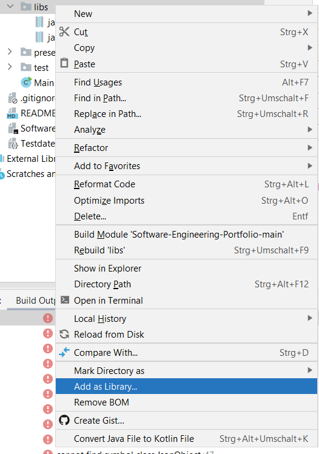

# Software-Engineering-Portfolio

## Setup

Der Ordner `libs` enthält die `.jar` Dateien der externen API `javax.json`.
Zum Ausführen des Java-Programms muss der Ordner `libs` lokal in IntelliJ/Eclipse mittels `add as library`zur Bibliothek hinzugefügt werden:

