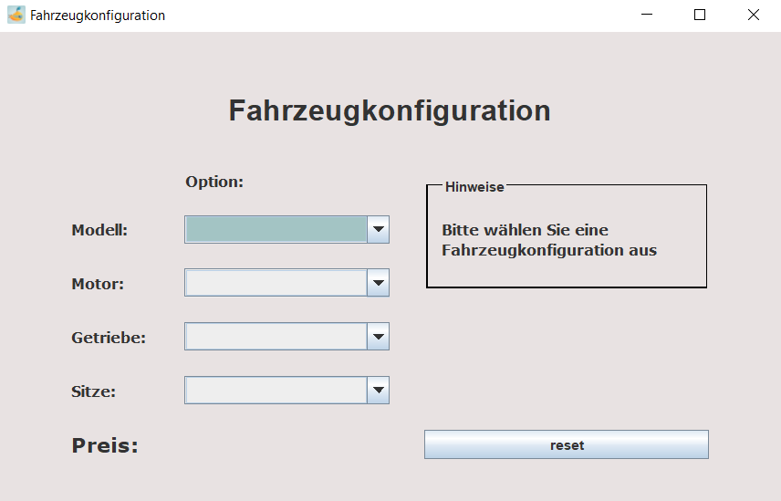
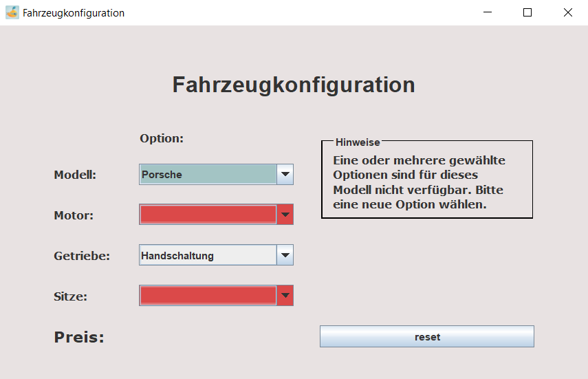
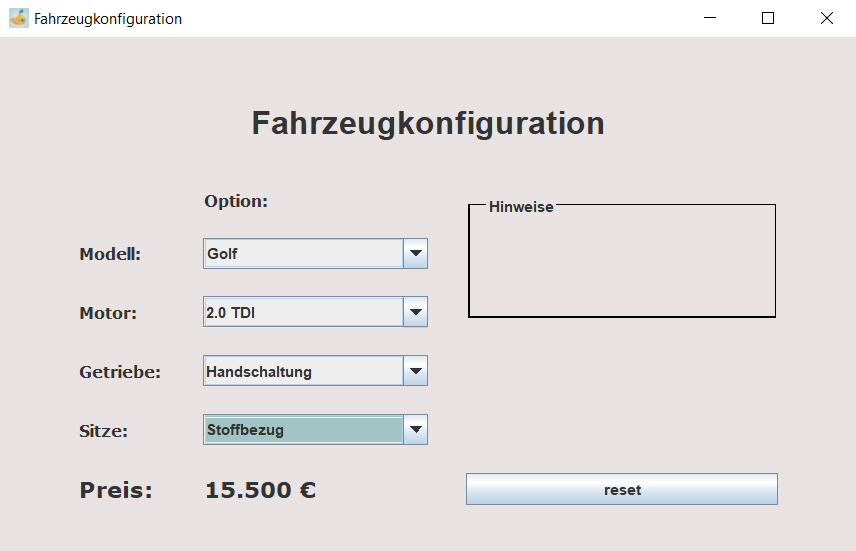

# Software-Engineering-Portfolio - Fahrzeugkonfigurator

## Idee
Dieses Projekt wurde im Rahmen des Moduls "Software Engineering I" des Studiengangs "Wirtschaftsinformatik - Software Engineering" an der DHBW Mannheim erstellt.

Programmiert wurde ein Fahrzeugkonfigurator, welcher verschiedene Konfigurationsdaten aus einer JSON Datei einliest. Auf einer grafischen Oberfläche kann die gewünschte Konfiguration gewählt werden, woraufhin der Preis der gewählten Konfiguration ausgegeben wird. Einige Konfigurationsoptionen sind nur für bestimmte Fahrzeugmodelle verfügbar.

## Konzept

Das Projekt basiert auf den folgenden Technologien:
* Java
* Jackson Object Mapper zum Parsen der JSON-Datei
* Java AWT und Java Swing für das UI
* JUnit5 für Tests

## Setup

Das Projekt kann direkt in IntelliJ oder Eclipse als Maven-Projekt importiert werden.

In seltenen Fällen erkennt IntelliJ nicht direkt, dass es sich um ein Maven-Projekt handelt, sodass die externen Bibliotheken nicht geladen werden und im Code rot markiert werden. In diesem Fall kann man links im Projekt-Explorer mit der rechten Maustaste auf "Software-Engineering-Portfolio" klicken, "Add Framework Support" auswählen und anschließend "Maven" wählen.

## User Interface

Das User Interface sieht folgendermaßen aus:

Wurden erst untergeordnete Optionen (Motor, Getriebe oder Sitze) ausgewählt und erst später das Modell, kann es sein, dass einige der gewählten Optionen nicht für dieses Modell verfügbar sind. In diesem Fall sind die betroffenen Felder rot markiert und der Benutzer wird über die Hinweis-Box aufgefordert, neue Optionen auszuwählen.

Nach erfolgter Konfigurationseingabe wird der Preis ausgegeben:

